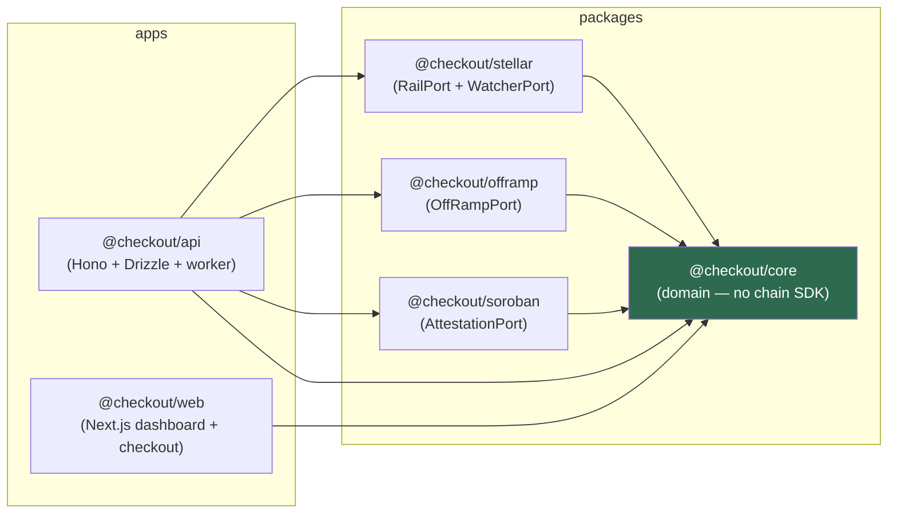
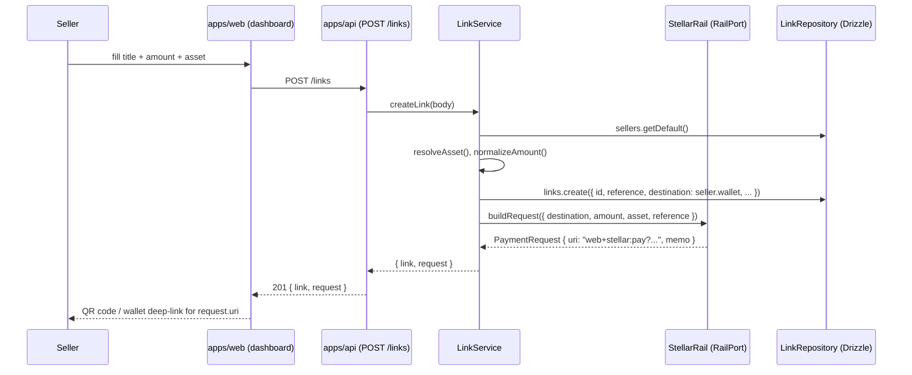
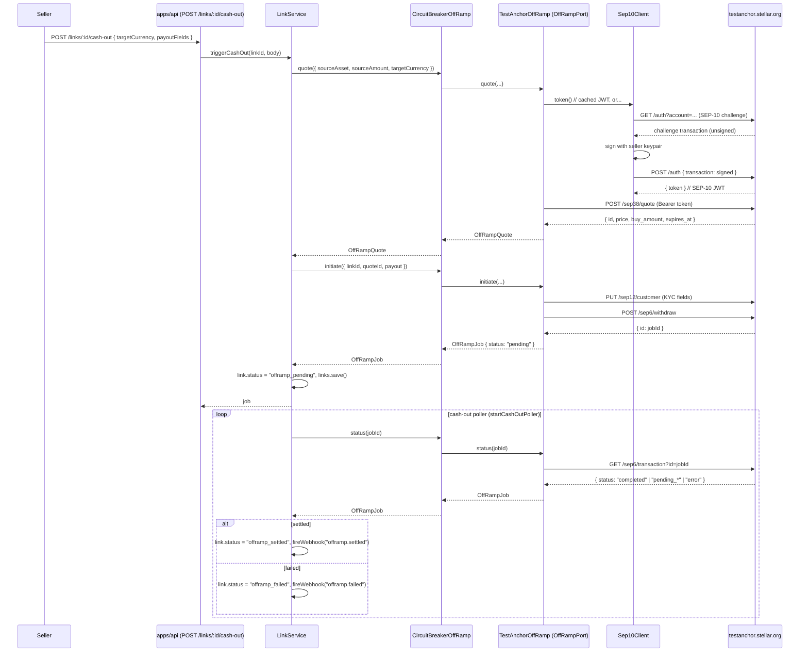
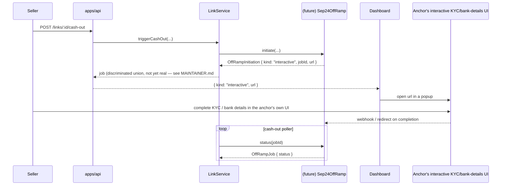
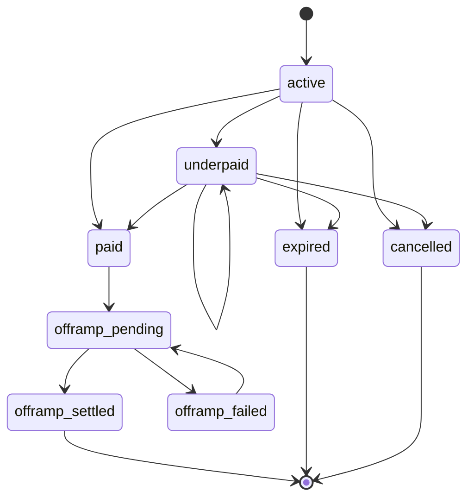

# Architecture

How the pieces connect — where to look before you touch `container.ts`.

The README explains *why* the boundaries exist (off-ramp custody, ports-and-adapters).
This document is the map: the package graph, the three ports and their implementations,
the flows through them, the status machine, and the decisions that shaped all of it.

---

## Package graph



- **`packages/core`** — the domain. Entities (`PaymentLink`, `Seller`, `Webhook`), the
  status machine (`domain/status.ts`), fixed-point money math (`domain/money.ts`, stroops
  as `BigInt`, never floats), the pure payment matcher (`matching/match-payment.ts`), the
  SEP-7 URI builder (`sep7/build-uri.ts`), zod request schemas (`schemas.ts`), and —
  critically — the **port interfaces** (`ports/index.ts`): `RailPort`, `WatcherPort`,
  `OffRampPort`, `AttestationPort`, plus the repository ports (`LinkRepository`,
  `SellerRepository`, `WebhookRepository`, `WatcherStateRepository`).
- **`packages/stellar`** — implements `RailPort` (`StellarRail`, builds SEP-7 pay URIs)
  and `WatcherPort` (`HorizonWatcher`, polls Horizon for payments and normalizes them).
- **`packages/offramp`** — implements `OffRampPort` twice: `MockAnchorOffRamp` (offline,
  fake FX rate, no money moves — the default) and `TestAnchorOffRamp` (real SEP-10 → SEP-38
  → SEP-6 against `testanchor.stellar.org`). `sep10.ts` is the *client*-side reference this
  doc's SEP-10 diagram mirrors on the server side, if/when 6.1 (wallet-native login) lands.
- **`packages/soroban`** — implements `AttestationPort` (`SorobanAttestation`), which
  writes settlement facts to the `quay-attest` contract (`contracts/quay-attest`) so a
  receipt can be checked without trusting whoever runs the API. It is the one adapter the
  product works fine without: unconfigured, receipts simply carry no attestation.
- **`apps/api`** — the composition root. `services/container.ts` wires one `RailPort` +
  one `WatcherPort` + one `OffRampPort` + the Drizzle repositories into `LinkService` and
  `WatcherLoop`, then Hono routes call `LinkService`. This is the *only* place all three
  ports get instantiated together — which is exactly why reading it feels like reading the
  whole system, and exactly why this doc exists so you don't have to.
- **`apps/web`** — depends only on `@checkout/core` (for shared types) and the API's HTTP
  surface (`lib/api.ts`). It never touches `packages/stellar` or `packages/offramp` — the
  dashboard and checkout page are thin clients over `docs/API.md`.

### The rule: the domain never imports a chain SDK

`packages/core` has zero dependencies on `@stellar/stellar-sdk`, `node:*` I/O modules, or
either adapter package. Chain-specific behavior (building a Stellar transaction, polling
Horizon, talking to an anchor's SEP endpoints) lives behind `RailPort` / `WatcherPort` /
`OffRampPort` in the adapter packages. The domain only ever sees the port's plain-data
shapes (`PaymentRequest`, `NormalizedPayment`, `OffRampQuote`, `OffRampJob`).

**Enforcement:** this isn't just a convention — `scripts/check-domain-boundary.mjs` walks
`packages/core/src` and fails if any file imports `@stellar/*`, any `node:*` module, or
either adapter package. It runs in CI (`pnpm docs:check-domain-boundary`, see `ci.yml`), so
a PR that violates the boundary fails the build, not just code review.

---

## The ports

| Port | Method(s) | Implementation today | What it hides |
| --- | --- | --- | --- |
| `RailPort` | `buildRequest()`, `isValidDestination()` | `StellarRail` (`packages/stellar`) | How a payer is asked to pay — SEP-7 URI today, could be an EVM calldata blob or a Lightning invoice for a different chain. |
| `WatcherPort` | `latestCursor()`, `fetchSince()` | `HorizonWatcher` (`packages/stellar`) | How incoming payments are observed — polling Horizon today; a streaming implementation (Horizon SSE, or a different chain's event log) satisfies the same interface with no change to `WatcherLoop`. |
| `OffRampPort` | `quote()`, `initiate()`, `status()` | `MockAnchorOffRamp` (offline demo) or `TestAnchorOffRamp` (real SEP-10→38→6) (`packages/offramp`) | How a seller's stablecoin becomes local currency — the actual anchor protocol conversation. Also wrapped by `CircuitBreakerOffRamp` (`apps/api/src/services/circuit-breaker.ts`) so a down anchor can't be hammered by every cash-out poll. |
| `AttestationPort` | `attest()`, `verify()` | `SorobanAttestation` (`packages/soroban`) → `contracts/quay-attest` | Where a settlement fact is published so it survives independently of this database — a Soroban registry today, but nothing in the domain says "contract" or "Stellar". Alone among the ports it is **optional**: it is never on the settlement path, so an absent or failing implementation costs a receipt its attestation and nothing else. |

All four are consumed only by `apps/api` (`LinkService`, `WatcherLoop`, `startCashOutPoller`)
— `packages/core`'s domain logic (the matcher, the status machine) takes their *output*
(`NormalizedPayment`, `MatchOutcome`) as plain arguments, never the ports themselves.

---

## Flows

### 1. Link creation



The `reference` becomes the on-chain `MEMO_TEXT` — it's the only thing correlating a
future payment back to this link, so `RailPort.buildRequest` always embeds it.

### 2. Payment detection and matching

```mermaid
sequenceDiagram
  participant Buyer
  participant Horizon
  participant Watcher as HorizonWatcher (WatcherPort)
  participant Loop as WatcherLoop
  participant Matcher as matchPayment() (pure, packages/core)
  participant LS as LinkService
  participant Hooks as WebhookSender

  Buyer->>Horizon: pays destination with memo=reference
  loop every WATCH_POLL_MS
    Loop->>Loop: links.activeDestinations()
    Loop->>Watcher: fetchSince(account, cursor)
    Watcher->>Horizon: GET /accounts/{account}/payments?cursor=...
    Horizon-->>Watcher: raw payment records
    Watcher-->>Loop: NormalizedPayment[]
    Loop->>Matcher: matchPayment(payment, findLinkByReference)
    Matcher-->>Loop: MatchOutcome (paid | underpaid | asset_mismatch | no_memo | unknown_reference)
    alt paid or underpaid
      Loop->>LS: applyMatch(payment, outcome)
      LS->>LS: canTransition() guard, then links.save()
      LS->>Hooks: fireWebhook("link.paid" | "link.underpaid")
    end
    Loop->>Loop: state.markProcessed(txHash, operationId), state.setCursor(account, lastToken)
  end
```

Idempotency is layered on purpose: the persisted **cursor** avoids refetching old
operations, the **processed-tx ledger** guards the crash window before a cursor is saved,
and the domain's `canTransition()` guard means a duplicate payment can never double-apply
even if both of the above somehow let it through. The processed-tx ledger keys on
`(txHash, operationId)`, not `txHash` alone — a transaction can carry more than one
payment operation, and each dedupes independently (issue 4.11).

### 3. Cash-out — SEP-10 → SEP-38 → SEP-6 (`TestAnchorOffRamp`, today's real adapter)



Every `CircuitBreakerOffRamp` call is instrumented (`anchor_calls_total`,
`anchor_call_duration_seconds` — see `docs/API.md#get-metrics`) and trips open after 3
consecutive failures, so a down anchor gets a 30s cooldown instead of being hit by every
poll tick.

### 4. Cash-out — SEP-24 interactive variant (not implemented — MAINTAINER.md roadmap item 1)



This flow doesn't exist in the codebase yet. It's here because it's the next real lever
(MAINTAINER.md's roadmap item 1: widen `OffRampInitiation` to a `{kind:"fields"} |
{kind:"interactive", url}` union) and a production LINK adapter needs SEP-24's redirect
step, which SEP-6 (today's adapter) has no concept of.

---

## State diagram — `LINK_STATUSES` / `TRANSITIONS`

Generated from `packages/core/src/domain/status.ts:17` by
`scripts/gen-status-diagram.mjs` — **do not hand-edit the diagram below.** Run
`pnpm docs:status-diagram` after changing `TRANSITIONS` and paste the new output here;
`pnpm docs:check-status-diagram` (wired into CI) fails the build if `status.ts` and
`docs/generated/status-diagram.mmd` disagree, so this can't silently drift.



Note the CI check only catches drift between `status.ts` and the `.mmd` file — it can't
verify you also updated *this* pasted copy. If you touch `TRANSITIONS`, update both.

---

## How to add a new chain / anchor / rail

The seam you need depends on what's actually changing:

**A new settlement chain** (e.g. an EVM chain instead of Stellar):
1. Implement `RailPort` (`buildRequest`, `isValidDestination`) for the new chain's
   payment-request format in a new `packages/<chain>` package.
2. Implement `WatcherPort` (`latestCursor`, `fetchSince`) against that chain's equivalent
   of Horizon — a JSON-RPC log poller, a block explorer API, whatever's available.
   `fetchSince` must return `NormalizedPayment[]` — same shape, chain-agnostic.
3. Wire both into `createContainer()` in `apps/api/src/services/container.ts` in place of
   `StellarRail` / `HorizonWatcher`. Nothing in `packages/core`, `LinkService`, or
   `WatcherLoop` changes — that's the point of the port.

**A new off-ramp anchor** (e.g. a licensed Nigerian anchor instead of the testnet sandbox):
1. Implement `OffRampPort` (`quote`, `initiate`, `status`) in a new file under
   `packages/offramp/src/`. `packages/offramp/src/testanchor.ts` is the reference shape —
   fork it. Its own header comment explains why it picked SEP-6 over SEP-24 (see
   Decisions, below) and what would need to change to support SEP-24 instead.
2. Swap it in via `createOffRamp()` in `container.ts` (currently branches on
   `env.offramp === "mock" | "testanchor"` — add a third case).
3. **Validate the anchor will actually onboard and pay out before building further.**
   See the README's "Before you go live" section — this is the step every anchor
   integration actually lives or dies on, not the adapter code.

**A new rail variant on the same chain** (e.g. a different memo scheme, or SEP-31 direct
send instead of a payment link): usually doesn't need a new port at all — check whether
`RailPort`/`OffRampPort`'s existing method shapes already cover it before adding one.

---

## Decisions

**Why polling, not streaming, for the watcher.** `HorizonWatcher` polls
(`WATCH_POLL_MS`, default 6s) instead of subscribing to Horizon's SSE stream. Polling is
restart-safe by construction — the persisted cursor means a crashed process picks up
exactly where it left off, with no reconnect/backoff/dedup logic to get subtly wrong.
`WatcherPort`'s interface (`latestCursor` + `fetchSince(account, cursor)`) doesn't assume
polling — a streaming implementation satisfies it too, and `WatcherLoop` wouldn't need to
change. Worth doing once the per-account poll loop stops scaling (see README item 5).

**Why `seller_initiated` off-ramp mode only, never `inline`.** `OffRampPort.mode` already
models both, but `inline` (value routed through the anchor mid-flight, seller receives
local currency directly) is what makes this a money-transmission business — custody
crosses from "seller's own wallet" to "in flight through us." `seller_initiated` keeps
custody at the edges: the seller already holds the stablecoin, and cash-out is a separate,
explicitly authorized action. Flip to `inline` only with a licensed anchor relationship and
a real compliance story — see the README's boundary note.

**Why SEP-6 in `TestAnchorOffRamp`, not SEP-24.** SEP-24's interactive withdraw needs a
redirect/popup concept somewhere upstream of the adapter — in the dashboard, in
`LinkService`, in the API response shape. None of that existed when the reference adapter
was built, and SEP-6 is fully field-driven (bank details go straight in the request body),
so it needed zero changes anywhere else. `testanchor.ts`'s own header comment captures this
rejection reasoning. The SEP-24 interactive diagram above is the shape that *would* need
those changes — MAINTAINER.md's roadmap item 1 (`OffRampInitiation` union) is the first
domino.

**Why path-payment settlement is parked** (decided 2026-07-18, see `MAINTAINER.md`).
Evaluated settling sellers in NGNC on-chain via Stellar path payments (buyer pays USDC,
seller receives NGNC directly, no anchor call in the checkout path at all). Ran a liquidity
check against mainnet Horizon's `/paths/strict-receive` (NGNC issuer from ngnc.online,
USDC Circle issuer):

| Destination | Best path | Implied rate | Verdict |
| --- | --- | --- | --- |
| ₦10,000 | 11.22 USDC | 891 NGN/USD | ~40%+ worse than the real rate (~1,500+) |
| ₦50,000 | 75.34 USDC | 664 NGN/USD | >100% worse |
| ₦500,000 | — | — | **no paths at all** |

The NGNC/USDC orderbook is effectively empty (one thin ask level, near-zero bids) — the DEX
can't carry real checkout volume. USDC settlement + anchor redemption (today's architecture)
stays the flagship path; a licensed anchor's SEP-24 adapter is the actual depth story.
Revisit path payments only after a real anchor relationship exists and *they* have a reason
to market-make the pair — this repo's off-ramp telemetry is the leverage for that ask.
